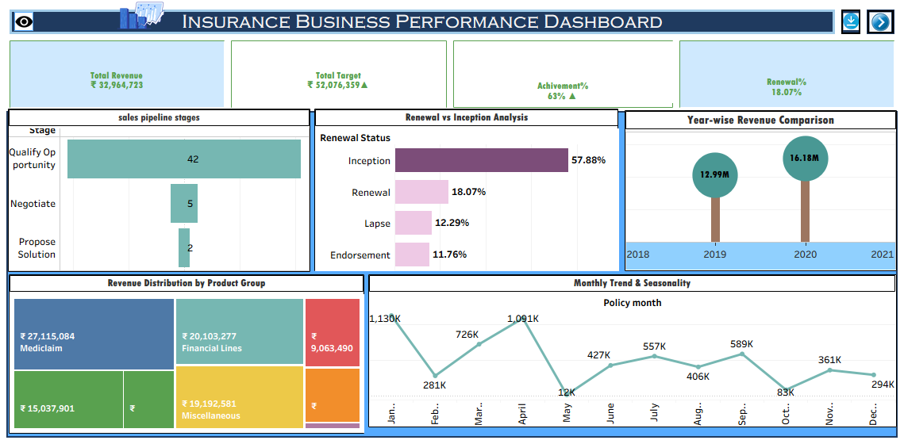

# Insurance Business & Executive Performance Dashboard

## Project Overview
This project analyzes insurance business performance and executive productivity using SQL, Excel, Tableau, and Power BI.

It focuses on:
- Revenue trends
- Sales pipeline efficiency
- Renewal performance
- Executive contribution

---

## Objectives
- Analyze revenue and business growth
- Evaluate sales pipeline stages
- Measure renewal vs new business performance
- Compare executive productivity

---

## Tools Used
- SQL
- Excel
- Tableau
- Power BI

---

# Dashboards

## Business Performance Dashboard
- KPI metrics (Revenue, Target, Achievement %, Renewal %)
- Sales pipeline analysis
- Renewal vs Inception breakdown
- Monthly & yearly trends

### Dashboard Preview



---

## Executive Performance Dashboard
- Executive-wise revenue
- Target vs Actual comparison
- Achievement % analysis
- Performance trends

### Dashboard Preview


---

## Key Insights
- Business achieved around 63% of target
- Revenue depends heavily on new business
- Renewal rate is low, indicating retention issues
- Top executives contribute majority revenue

---

## Project Structure

```text
Dataset/
SQL/
Excel-Dashboard/
Tableau-Dashboard/
PowerBI-Dashboard/
Dashboard-Screenshots/
```

---

## Conclusion
This project provides insights into business performance and executive productivity, helping identify growth opportunities and areas for improvement using data-driven analysis.

---

## Author
**Shital Dhokare**
